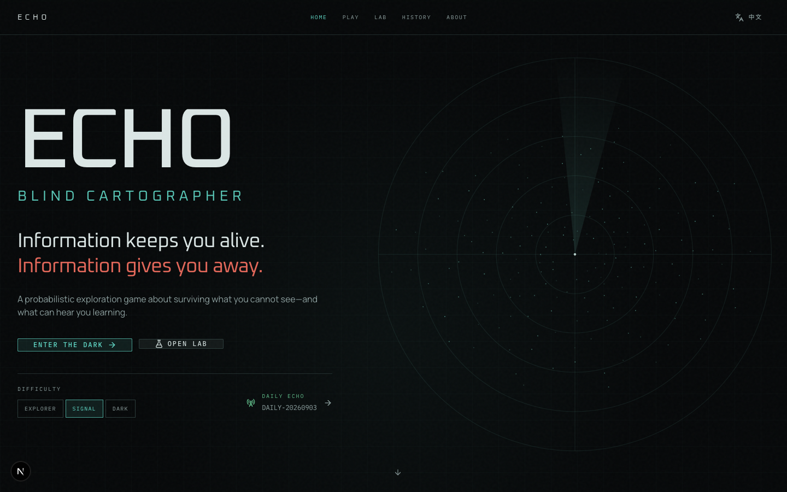
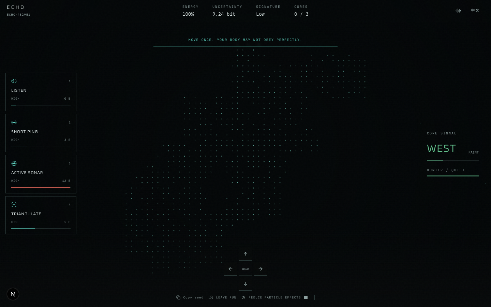
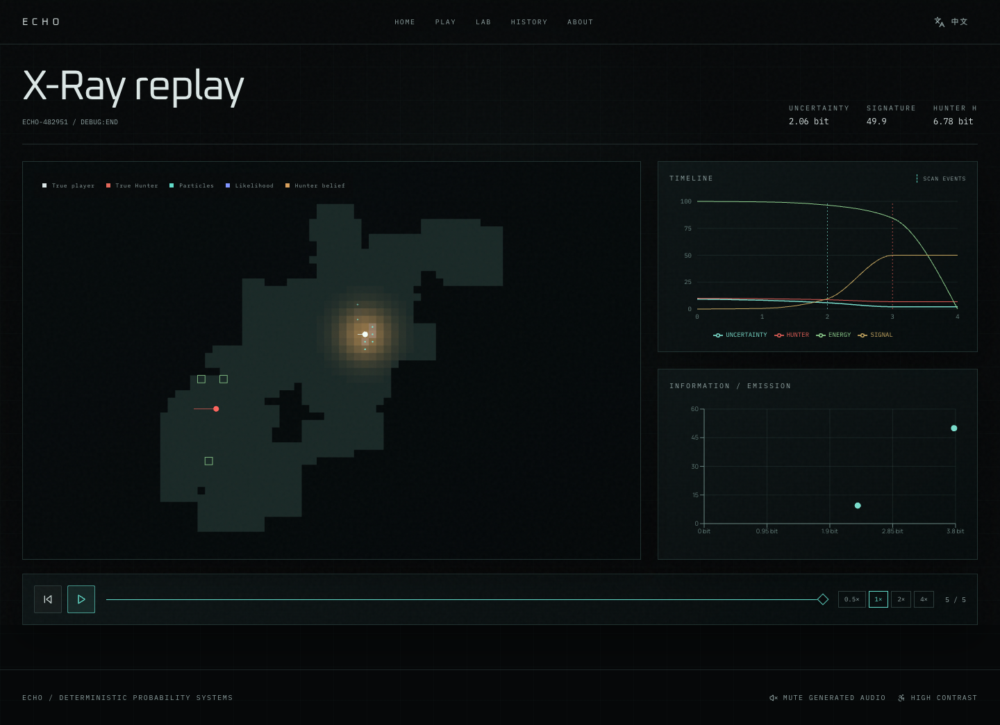
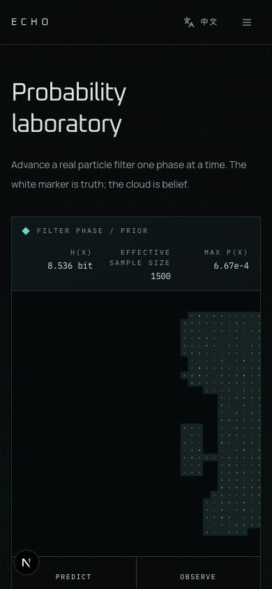
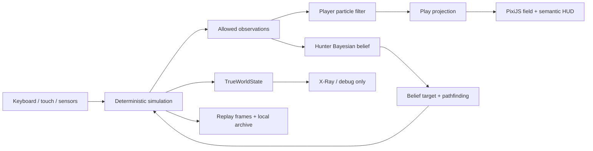

<div align="center">

# ECHO — Blind Cartographer

### Information keeps you alive. Information gives you away.

A bilingual probabilistic exploration game in which the map is hidden, movement is uncertain, and every useful observation helps a Bayesian Hunter find you.

[](https://github.com/kyky2347/echo-blind-cartographer/actions/workflows/ci.yml)
[](https://nodejs.org/)
[](https://nextjs.org/)
[](https://www.typescriptlang.org/)
[](#english--中文)

</div>



ECHO is a complete browser game and an inspectable probabilistic-systems project. The player never receives the true map or true position. Instead, a Sequential Monte Carlo particle filter constructs a changing belief field from noisy motion and sensor evidence. Stronger observations reduce uncertainty—but also produce stronger emissions for a separate Hunter inference system.

This is not a scripted visualization: the facility, noise, posterior distributions, expected information gain, Hunter search, score, charts, and replay are all driven by the same deterministic simulation.

## What makes ECHO different

| System | What it contributes |
| --- | --- |
| **The belief field is the interface** | Normal play renders the player posterior rather than exposing hidden geometry or coordinates. |
| **Information has a cost** | Four sensors trade energy and acoustic signature for different likelihood models and expected information gain. |
| **Two competing beliefs** | The player estimates position while the Hunter maintains a separate posterior over the player's location. |
| **Deterministic uncertainty** | A seeded PRNG drives map generation, sensor noise, movement noise, and Hunter behavior, making runs reproducible. |
| **Inspectable outcomes** | Every completed run produces measured statistics, transparent score components, charts, and an X-Ray replay. |

## Product tour

### Play the posterior

The central field is a live particle approximation of `p(xₜ | z₁:ₜ, u₁:ₜ)`. Sensor controls name the expected information, energy cost, and emitted signature before the player commits.



### Inspect the hidden system

X-Ray replay reveals true geometry, both true actors, player particles, observation likelihood, Hunter belief, paths, scan events, and the information-versus-emission tradeoff.



### Learn by advancing the filter

The Probability Lab exposes the real predict → observe → normalize → resample pipeline one phase at a time and lets users vary particle count, motion noise, sensor noise, false positives, and resampling thresholds.

<p align="center">
  
</p>

## Feature set

- Deterministic 48 × 48 connected facilities with rooms, loops, corridors, three reachable Data Cores, a gated Extraction point, beacons, and recharge placement.
- Noisy movement and Sequential Monte Carlo localization with log-weight normalization, Shannon entropy, effective sample size, and systematic resampling.
- Passive structural listening, short-range ping, active sonar, and log-distance RSSI beacon triangulation.
- Monte Carlo expected information gain previews and measured prior-to-posterior information gain.
- A grid Bayesian Hunter posterior, emission likelihood updates, mode escalation, target selection, and shortest-path movement through true geometry.
- Energy, cooldowns, decaying signature, objective collection, extraction, contact loss, and energy loss.
- Seed replay, Daily Echo, local run archive, post-run debrief, interactive X-Ray timeline, and transparent score breakdown.
- English and Simplified Chinese parity, keyboard and touch controls, generated audio, mute, reduced motion, reduced particles, high contrast, and non-color state labels.
- Responsive desktop and mobile layouts with semantic controls and real-browser smoke coverage.

## Quick start

Requirements:

- Node.js 20 or newer
- pnpm 11.19.0 or a compatible pnpm 11 release

Clone and run:

```bash
git clone https://github.com/kyky2347/echo-blind-cartographer.git
cd echo-blind-cartographer
pnpm install --frozen-lockfile
pnpm dev
```

Open [http://localhost:3000](http://localhost:3000).

One-line launch after cloning:

```bash
cd echo-blind-cartographer && pnpm start:all
```

Production build:

```bash
pnpm build
pnpm --filter @echo/web start
```

## Controls

| Action | Keyboard | Touch / pointer |
| --- | --- | --- |
| Move | `W A S D` or arrow keys | Direction pad |
| Passive listen | `1` | Listen |
| Short ping | `2` | Short Ping |
| Active sonar | `3` | Active Sonar |
| Beacon triangulation | `4` | Triangulate |
| Switch language | Header control | Header control |

Normal play never exposes the true world. For deterministic QA only, append `?debug=1` to `/play`; the debug overlay reveals true state and offers a controlled debrief trigger.

## Architecture



`packages/inference-core` is framework-independent and owns simulation truth. `apps/web` receives projections and observations, then renders them with PixiJS and semantic HTML. PixiJS never owns gameplay state, and normal Play components never receive `TrueWorldState`.

```text
echo-blind-cartographer/
├── apps/web/                 Next.js application, HUD, routes, i18n and browser tests
├── packages/inference-core/  Seeded simulation, probability, sensors and Hunter AI
├── docs/math/                Derivations and implementation notes
├── docs/                     Architecture, game design, generation and replay docs
├── DESIGN.md                 Visual system and interaction rules
├── PRODUCT.md                Product brief and acceptance criteria
└── .github/workflows/        Reproducible CI quality gates
```

See the detailed [architecture](docs/architecture.md), [game design](docs/game-design.md), [procedural generation](docs/procedural-generation.md), and [replay system](docs/replay-system.md) documentation.

## Probability systems

The player belief is approximated by weighted particles:

```math
p(x_t \mid z_{1:t}, u_{1:t}) \approx \sum_{i=1}^{N} w_t^{(i)}\,\delta(x_t-x_t^{(i)})
```

Movement applies the transition model. Sensor observations update log weights with `p(zₜ | xₜ)`, normalization recovers probability mass, and low effective sample size triggers systematic resampling. Entropy is computed from the binned position mass; displayed information gain is the measured entropy change.

The Hunter does not read the player's true location as a target. It updates its own grid posterior from movement and sensor emissions, selects a posterior target, and searches only through traversable true geometry.

Implementation notes:

- [Particle filtering](docs/math/particle-filter.md)
- [Sensor likelihoods](docs/math/sensors.md)
- [Expected information gain](docs/math/information-gain.md)
- [Hunter inference](docs/math/hunter-inference.md)

## Determinism and replayability

World generation and simulation use serializable, labeled deterministic random streams derived from the run seed. Given the same seed, difficulty, and action sequence, ECHO reproduces facility geometry, objective positions, movement outcomes, sensor noise, and Hunter updates. Wall-clock IDs and save timestamps are intentionally metadata rather than simulation inputs.

Replay frames contain bounded particle samples and measured system state, not rendered video. Local data is validated before use so malformed browser storage cannot crash History, Debrief, or X-Ray pages.

## Quality gates

```bash
pnpm check       # lint + strict typecheck + unit/component tests + production build
pnpm test:e2e    # Chromium desktop and mobile product journeys
pnpm benchmark   # deterministic engine benchmark
```

Current verified baseline on 2026-09-03:

| Gate | Result |
| --- | --- |
| ESLint | Zero warnings |
| TypeScript | Strict workspace typecheck passes |
| Vitest | 18 engine and frontend tests pass |
| Playwright | 7 journeys pass; 1 desktop skip is a mobile-only assertion |
| Next.js | 10 routes build successfully |

CI installs from the lockfile, runs lint, strict typechecking, unit/component tests and the production build, then installs Chromium and executes the desktop browser suite on every push and pull request. Benchmarks remain an explicit local measurement step because results are hardware-dependent.

## Measured performance

Measured on Apple M4, Darwin arm64, Node v24.18.0, 30 rounds:

| Operation | Mean | p95 |
| --- | ---: | ---: |
| 48 × 48 facility generation | 1.17 ms | 1.79 ms |
| 10,000-particle sonar update and possible resample | 3.10 ms | 4.01 ms |

These are engine measurements from `pnpm benchmark`, not invented browser-frame claims. Live PixiJS rendering reuses its WebGL application, caps Play at 30 FPS, limits device pixel ratio to 2, and pauses ambient work outside the viewport or while the document is hidden. See [performance methodology](docs/performance.md).

## English / 中文

ECHO supports English and Simplified Chinese across navigation, gameplay, sensor consequences, tutorial guidance, Lab controls, run history, debrief metrics, replay legends, charts, accessibility labels, and error/loading states. The selected language and accessibility preferences persist locally.

ECHO 是一款双语概率探索游戏。玩家无法看到真实地图或真实坐标，只能根据带噪移动与传感器观测，通过粒子滤波器逐步建立位置后验。更强的传感器会更快降低不确定性，但也会产生更强的信号，让维护独立贝叶斯后验的猎手更容易找到玩家。

项目提供完整游戏流程、每日种子、概率实验室、本地历史、结算分析、X-Ray 回放、桌面与移动端适配，以及可复现的确定性测试。界面右上角可以随时切换 English / 中文。

快速启动：

```bash
git clone https://github.com/kyky2347/echo-blind-cartographer.git
cd echo-blind-cartographer
pnpm install --frozen-lockfile
pnpm dev
```

浏览器访问 [http://localhost:3000](http://localhost:3000)。

## Project status and scope

ECHO is a self-contained local-first game. It does not require an account, backend, analytics service, cloud leaderboard, or paid API. Runs and preferences are stored in the browser. Generated Web Audio begins only after user interaction.

The optional Rust/WASM acceleration seam is documented but not falsely presented as active: the measured TypeScript engine is currently the production path. See [CONTRIBUTING.md](CONTRIBUTING.md) for engineering expectations and [SECURITY.md](SECURITY.md) for responsible reporting.
